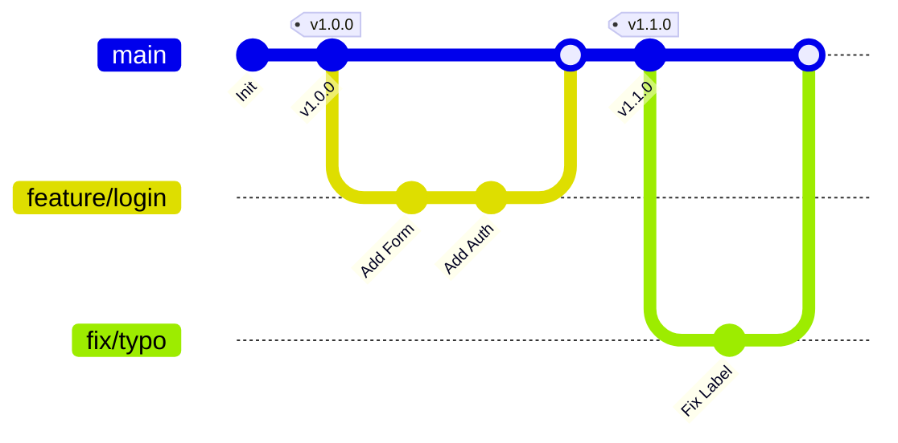

# Branching & Remote Operations

## Branch & Merge
Branch operations and history tracking.



```bash
git branch
# List your branches. A * will appear next to the currently active branch

git branch [branch-name]
# Create a new branch at the current commit

git branch -d [name]
# Delete a branch from your repository

git branch -D [name]
# Force delete a branch from your repository

git checkout [branch-name]
# Switch to another branch and check it out into your working directory

git checkout -b [new-branch]
# Create a new branch and switch to it

git merge [branch]
# Merge the specified branch’s history into the current one

git merge --abort
# Abort a merge and return to the pre-merge state (use after merge conflicts)

git log
# Show all commits in the current branch’s history

git log --graph
# Print an ASCII graph of the commit and merge history

git log --oneline
# Print each commit on a single line
```

## Share & Update
Synchronizing your repository with remotes.

```bash
git remote
# Manage the set of tracked remote repositories

git remote -v
# Show remote URLs for fetch/push

git remote show <name>
# Display detailed information about a specific remote

git remote update
# Fetch updates from all remotes or a group of remotes

git remote add [alias] [url]
# Add a git URL as an alias

git branch -r
# List all remote-tracking branches

git fetch [alias]
# Fetch all the branches from that Git remote

git merge [alias]/[branch]
# Merge a remote branch into your current branch to bring it up to date

git push [alias] [branch]
# Transmit local branch commits to the remote repository branch

git pull
# Fetch and merge any commits from the tracking remote branch
```

## Temporary Commits
Preserve work-in-progress using stash.

```bash
git stash
# Save modified and staged changes

git stash list
# List stack-order of stashed file changes

git stash pop
# Write working from top of stash stack

git stash drop
# Discard the changes from top of stash stack
```

## Tracking Path Changes
Tracking file renames and deletions.

```bash
git rm [file]
# Delete the file from project and stage the removal for commit

git mv [existing-path] [new-path]
# Change an existing file path and stage the move

git log --stat -M
# Show all commit logs with indication of any paths that moved
```

## Inspect & Compare
Comparing branches, diffs, and commit history.

```bash
git log
# Show the commit history for the currently active branch

git log branchB..branchA
# Show the commits on branchA that are not on branchB

git log --follow [file]
# Show the commits that changed file, even across renames

git diff branchB...branchA
# Show the diff of what is in branchA that is not in branchB

git show [SHA]
# Show any object in Git in human-readable format
```

## Rewrite History
Rewriting and cleaning up commit history.

```bash
git rebase [branch]
# Apply any commits of current branch ahead of specified one

git reset --hard [commit]
# Clear staging area, rewrite working tree from specified commit
```

> [!CAUTION]
> Use with caution. Do not rewrite history on shared/public branches.

## Ignoring Patterns
Preventing unintentional staging or committing of files.

```bash
git config --global core.excludesfile [file]
# System-wide ignore pattern for all local repositories
```

**Example .gitignore:**
```gitignore
logs/
*.notes
pattern*/
```
*Save a file with desired patterns as .gitignore with either direct string matches or wildcard globs.*
