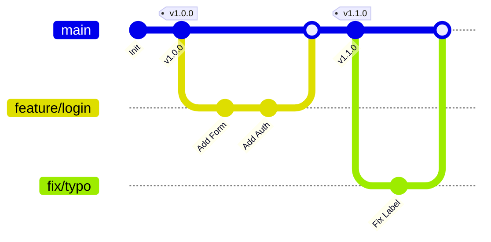

# Team Operations Manual & Contribution Guide

This manual defines the "Rules of the Road" for maintaining a clean, professional codebase.

## 1. The Golden Rule
**`main` is Production.**
The code on the `main` branch must always be stable, deployable, and working. We never push code directly to `main`. All changes must pass through a Pull Request (PR) review.

## 2. Issue-Driven Development
**We plan before we code.**
1.  **Create an Issue:** If you want to build a feature or fix a bug, write a "ticket" in the Issues tab first.
    * **Title:** Concise summary (e.g., "Add Dark Mode Toggle").
    * **Description:** clearly define *what* needs to be done and *why*.
2.  **Link it:** When opening a PR later, include `Closes #IssueNumber` in the description.

## 3. Git Workflow (Branching Strategy)
We use a simplified **Feature Branch Workflow**.



### Step 1: Branching
Every distinct task gets its own sandbox. Name your branches based on the work type:
* **Features:** `feature/feature-name` (e.g., `feature/user-authentication`)
* **Bug Fixes:** `fix/bug-name` (e.g., `fix/login-timeout`)
* **Documentation:** `docs/update-readme`
* **Refactoring:** `refactor/optimize-database-queries`

```bash
git checkout -b feature/my-new-feature
```

### Step 2: The Pull Request (PR)
When the work is done:
1.  **Push:** `git push origin feature/my-new-feature`
2.  **Open PR:** Create a Pull Request targeting `main`.
3.  **Self-Review:** Check your own diffs. Fix typos and remove commented-out code.
4.  **Merge:** Use "Squash and Merge" to combine all your work into one clean commit on the `main` history.

## 4. Commit Standards (Conventional Commits)
We write commit messages for machines, not just humans. This allows for auto-generated changelogs.

**Format:** `type(scope): description`

| Type | Meaning | Example |
| :--- | :--- | :--- |
| **feat** | New functionality | `feat(auth): add google oauth login` |
| **fix** | Bug repair | `fix(api): handle timeout 500 error` |
| **docs** | Documentation | `docs: update setup instructions` |
| **style** | Formatting (spaces, semi-colons) | `style(ui): reformat css to standard` |
| **refactor** | Code change, no behavior change | `refactor(core): optimize loop performance` |
| **chore** | Build/Tooling changes | `chore: update .gitignore` |

**Example of a Perfect Commit:**
`feat(ui): implement exponential smoothing for animations`

## 5. Versioning Strategy (SemVer)
We follow Semantic Versioning 2.0.0 (MAJOR.MINOR.PATCH).

*   **MAJOR** (1.0.0 -> 2.0.0): Breaking changes.
    *   *Example: Changing an API endpoint structure so old clients cannot connect.*
*   **MINOR** (1.3.0 -> 1.4.0): New features in a backward-compatible way.
    *   *Example: Adding a new optional setting or button.*
*   **PATCH** (1.3.1 -> 1.3.2): Bug fixes only.
    *   *Example: Fixing a typo or a crash on a specific OS.*

## 6. Release Protocol
When ready to ship a new version to users:
1.  **Tag:** Create a new Release Tag (e.g., `v1.4.0`) on GitHub.
2.  **Build:** Generate your production artifacts (binaries, installers, minified scripts).
3.  **Upload:** Attach the artifacts to the Release "Assets" section.
4.  **Announce:** Paste the Changelog (generated from your Conventional Commits) into the description.

\newpage
